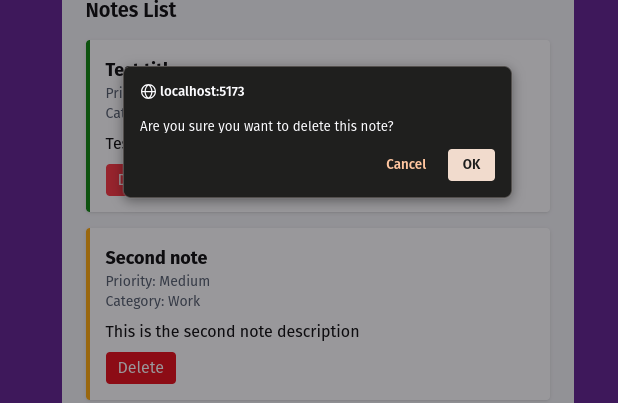

# Priority Note taking app

Just a simple note taking app where the user can:

1. Write a title
2. Assign priority
3. Select a category
4. Write a description
5. Add a note (create a list)
6. Delete a note

This demonstrates use of forms, controlled inputs, hooks, and conditional rendering.

---

### Screenshots

<table>
  <tr>
    <td align="center"> No Notes</td>
    <td align="center"> Show Form</td>
  </tr>
  <tr>
    <td align="center"> First Note</td>
    <td align="center"> Different Priorities</td>
    <td align="center"> Deleting Note</td>
  </tr>
</table>