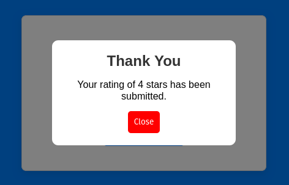

# Rating UI

This is a simple rating app to show the fundamentals of React such as components, props, state, events...

The rating app will allow you to:
1) Choose the number of stars in your rating
2) Change the heading for each rating
3) Submit the rating

The rating will reset after submission. 




## Usage

Install Dependencies

```bash
npm install
```

Run project

```bash
npm run dev
```
