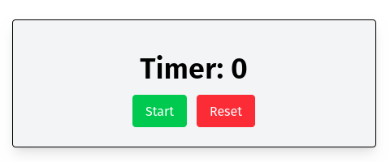

# Simple Timer App

I realize this is a very simple application, but its main purpose is to demonstrate the use of the `useRef` hook in React. This project shows how to:

- Select DOM elements using `useRef`
- Persist values across re-renders with `useRef`
- Use `useRef` in combination with `useEffect`

It's intended as a focused example for learning and reference.

